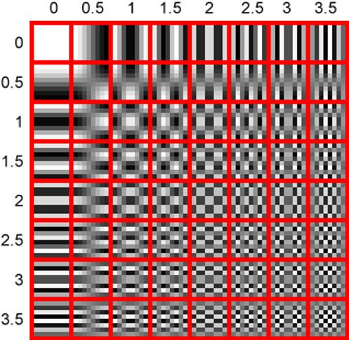
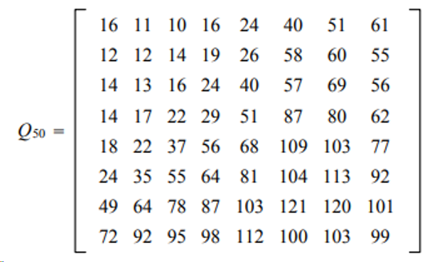
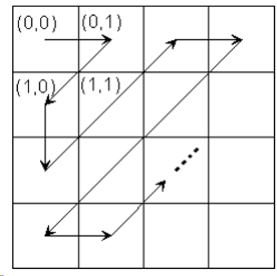
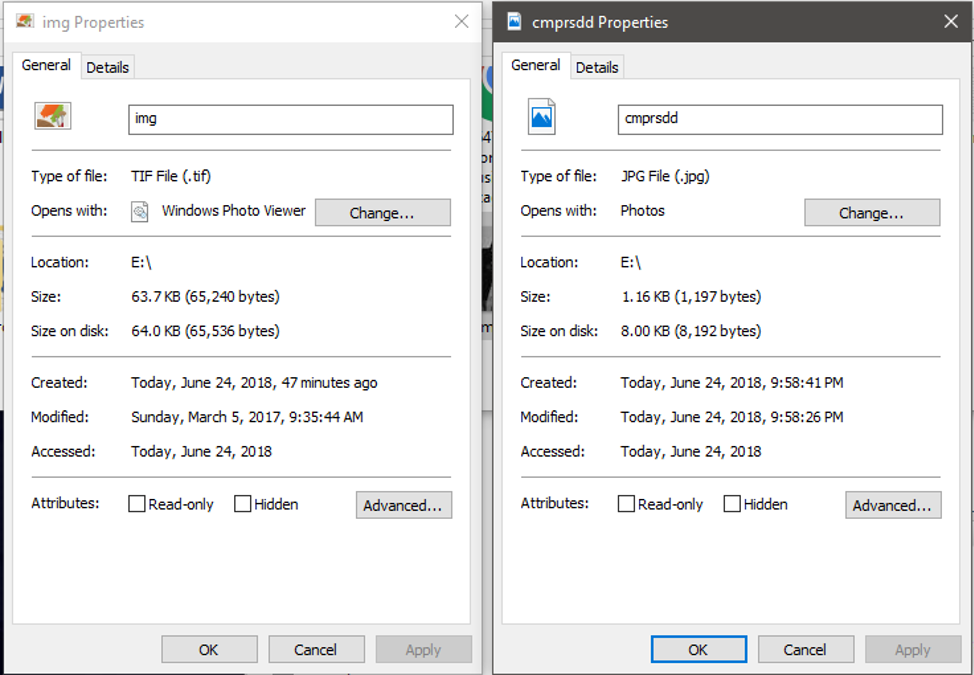

# This is unsupported. I may or may not maintain this repo in the future. I've written this code way back 2018 for a School Project in Computer Vision

Five different techniques (DCT, Quantization, Zigzag Scanning, RLE & DPCM, Entropy Coding(Huffman))

Image compression is the way of scaling down the size of graphic images, without degrading the quality of image to unreasonable image. This scaling allows the user to store more images in a given memory space, which also helps to send or download the picture in internet faster.

Although there are different ways in compressing an image, the lossless and lossy; This paper will tackle the lossy compression.

Lossy compression or the irreversible compression, this is the method that removes the redundant data from original file and it permanently discards it. It comprises the techniques called DCT or Discrete Cosine Transform, Quantization, Zig-zag Scanning, RLE and DPCM, and Entropy Coding.

To start with Discrete Cosine Transform, remember the way of cosines in math? It only goes up and down, ranging from 1 to negative 1. We get the sum of cosine function then or it transform the signals into a numerical value so the information we can have exist in quantitative form and we can use it to manipulate the values such as using QUANTIAZATION. Before the Quantization we will transform the image in 8x8 block. So, the quantization can work.

The first step is we level of the images from -128 to 127, we subtract 128 from original entry. For example the first value of row (0, 0) is: 154 then we subtract 128 from it. It becomes 26. It goes from every matrix up to (8, 8) Then we get the DCT values or the HIGH INTENSITIES of an image for it to compare to the DCT table figure below. 

  

We get the matrix of an 8x8 by multiplying the DCT coefficients to the matrix that we’ve subtracted from the original entry. The formula will be
D = TMT’
D = Applied DCT, T = Table of DCT, M = Subtracted Matrix, T’ = Inverse of Table of DCT

After we get the shifted block or the applied DCT in the matrix we can have the new values. Note: The uppermost or the top-left coefficients correlates to low frequencies of the original image block. It is important that the human eye is sensitive to low frequencies color. Because of this, the quantization will step in. 

To get the quantized value of a matrix we have this formula

C = D/Q50
Which C = the Quantized Value, D = Applied DCT table, Q50 = Standard Table of Quantization (Figure Below)(Level 50)

  

This quantization can only be achieved by dividing each element in applied DCT matrix, by the corresponding element in quantization matrix.  Once we get the new value of matrix, you can notice that most of value is zero. And the top left of the matrix contains positive and negative integers. Those only positive and negative integer makes impact on our image. Because the argument is that with those positive and negative integers, we can have our own image back. This where the Zigzag scanning comes.

To compress the file we use the Entropy Coding or The Huffman coding. We only get the positive and the negative values, then we remove or disregard the 0 values. But to find those, we use the zigzag scanning. Which does this (figure below)

  

This scanning will order the quantized matrix to appear first, then the lower after.

This scanning improves the compression of the RLE or Run Length encoding (lossless compression), which does compress the image as if its appear redundant. For example, there’s 1 1 1 2 3 2 2 4 4 1. We can compress this as (3 ones) 1 | (one two) 2| (one three) 3| (two two) 2| (two fours) 4 | (one one) 1 = 123241
This methods doesn’t differ from combined RLE and DPCM which means that the compression was made because of the difference between the current and the previous 8x8 block. 

After this method, to compress the file we use Entropy Coding. The technique we will be using is Huffman Coding. In this technique each color is counted in its occurrence in 8x8 block. Then we sort this colors in decreasing frequency. After sorting, we build a tree, node that can connect to either or another color.

As you can see in their properties: 

  

As you can see, the compression rate of combined algorithms is 12.5 percent. (.125 x 65536 bytes  = 8192 bytes).

JPEG MODES

Sequential, in this mode images are encoded from top to bottom. Each color component in this mode is completely encoded in single scan. There are two alternative entropy coding, the Huffman Coding, and the Arithmetic Coding.

Progressive, in this mode components are encoded in “n” scans. The compressed data for each component is placed in minimum of 2 and as many as 896 scans. The first scan creates a rough version of the picture, while subsequent scans makes it less rough.

Lossless, this preserves the exact original image, which has small compression ratio.

Hierarchical, this is the super-progressive mode which the image is broken into several frames, every frame is collection of many scans. Like the progressive mode, the first thing created is a low resolution of image. As this progresses, the remaining frames is refined by increasing the solution.
